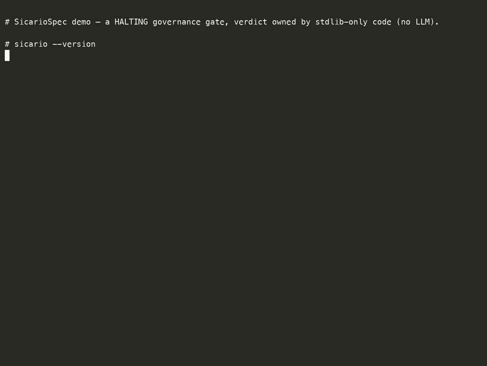

# SicarioSpec verify demo

A real terminal recording of the halting governance gate: a passing run (exit 0)
and a failing run (exit 1, `SICARIO-MISSING-THREAT-MODEL`). The verdict is owned
by stdlib-only Python — no LLM is in the decision path.



- Recording: [`verify-demo.cast`](verify-demo.cast) (asciinema v2)
- GIF: [`verify-demo.gif`](verify-demo.gif)
- Regenerate both: [`record.sh`](record.sh) (installs into a throwaway venv,
  records with `asciinema`, renders the GIF with `agg`)

## Exact commands

```bash
# In a throwaway venv:
python3 -m venv .venv && . .venv/bin/activate
pip install -e .          # installs the `sicario` command

sicario --version
sicario init demo-proj --profile appsec        # scaffold a governed repo
sicario verify examples/python-api             # PASS  -> exit 0
sicario verify examples/python-api-failing     # FAIL  -> exit 1
```

## Real captured output

These blocks are copied verbatim from the recorded session — not edited or
fabricated. Reproduce them with [`record.sh`](record.sh) or the commands above.

```text
$ sicario --version
sicario 0.4.0
```

`sicario init demo-proj --profile appsec` (tail):

```text
  [created] /…/demo-proj/.github/workflows/sicario-verify.yml
  [created] /…/demo-proj/.github/workflows/docs-site.yml
  summary: 37 created
SicarioSpec initialized at /…/demo-proj
Next: cd into the project and run `sicario verify`.
```

Passing gate (exit 0):

```text
$ sicario verify examples/python-api
sicario verify passed
$ echo $?
0
```

Failing gate — the same feature with `docs/security/threat-model.md` removed.
The gate **halts**: non-zero exit and a named finding code, so CI / a merge gate
blocks (exit 1):

```text
$ sicario verify examples/python-api-failing
HIGH SICARIO-MISSING-THREAT-MODEL docs/security/threat-model.md: Missing docs/security/threat-model.md
sicario verify failed with 1 finding(s)
$ echo $?
1
```

Same gate, opposite verdict, decided entirely by non-AI code. A gate that can
only pass is not a gate — this is the proof it halts.
